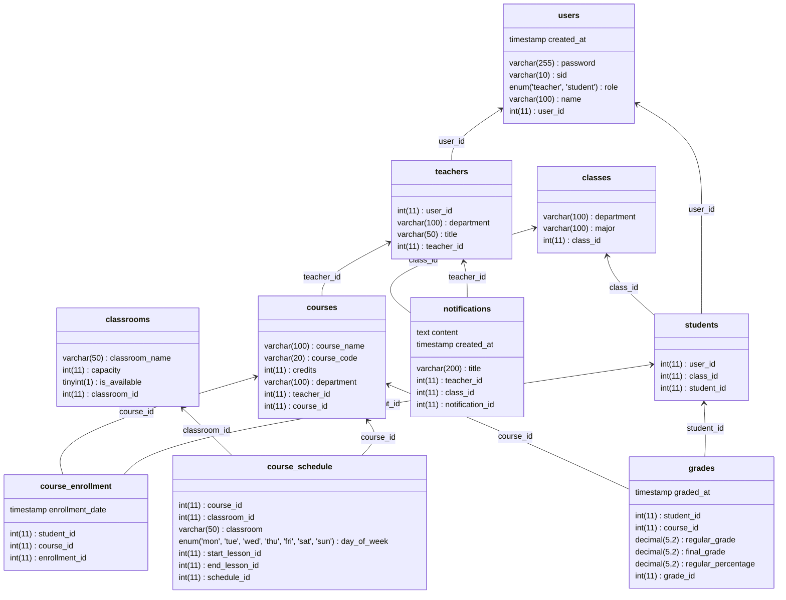

See also: [Schema](../src/database/schema.sql)

```mermaid
classDiagram
direction BT
class classes {
   varchar(100) department
   varchar(100) major
   int(11) class_id
}
class classrooms {
   varchar(50) classroom_name
   int(11) capacity
   tinyint(1) is_available
   int(11) classroom_id
}
class course_enrollment {
   int(11) student_id
   int(11) course_id
   timestamp enrollment_date
   int(11) enrollment_id
}
class course_schedule {
   int(11) course_id
   int(11) classroom_id
   varchar(50) classroom
   enum('mon', 'tue', 'wed', 'thu', 'fri', 'sat', 'sun') day_of_week
   int(11) start_lesson_id
   int(11) end_lesson_id
   int(11) schedule_id
}
class courses {
   varchar(100) course_name
   varchar(20) course_code
   int(11) credits
   varchar(100) department
   int(11) teacher_id
   int(11) course_id
}
class grades {
   int(11) student_id
   int(11) course_id
   decimal(5,2) regular_grade
   decimal(5,2) final_grade
   decimal(5,2) regular_percentage
   timestamp graded_at
   int(11) grade_id
}
class notifications {
   varchar(200) title
   text content
   int(11) teacher_id
   int(11) class_id
   timestamp created_at
   int(11) notification_id
}
class students {
   int(11) user_id
   int(11) class_id
   int(11) student_id
}
class teachers {
   int(11) user_id
   varchar(100) department
   varchar(50) title
   int(11) teacher_id
}
class users {
   varchar(255) password
   varchar(10) sid
   enum('teacher', 'student') role
   varchar(100) name
   timestamp created_at
   int(11) user_id
}

course_enrollment  -->  courses : course_id
course_enrollment  -->  students : student_id
course_schedule  -->  classrooms : classroom_id
course_schedule  -->  courses : course_id
courses  -->  teachers : teacher_id
grades  -->  courses : course_id
grades  -->  students : student_id
notifications  -->  classes : class_id
notifications  -->  teachers : teacher_id
students  -->  classes : class_id
students  -->  users : user_id
teachers  -->  users : user_id
```
